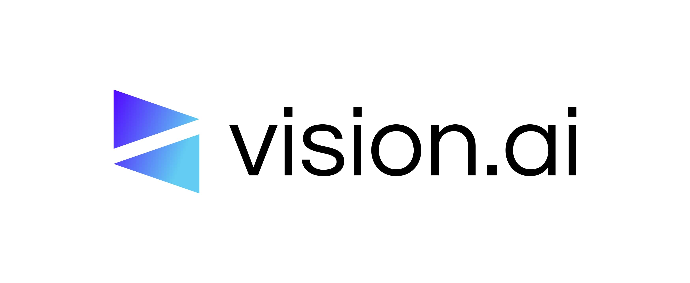

# Vision AI

Welcome to the official GitHub organization for **Vision AI**!

At Vision AI, we are building the future of automated operations for Small and Medium Businesses (SMBs) through intelligent agentic systems. We empower SMBs to scale efficiently, enhance customer experiences, and unlock new levels of productivity by transforming complex workflows into seamless, AI-driven processes.

---

## Our Vision

To be the leading platform for intelligent, autonomous AI agents, enabling SMBs worldwide to operate with unprecedented efficiency, personalization, and strategic foresight, transforming their daily operations into an AI-first future.

## Our Mission

To democratize advanced AI automation for SMBs by developing and deploying sophisticated, integrated agentic systems that perceive, reason, plan, and execute complex tasks, reducing operational inefficiencies, enhancing customer satisfaction, and fostering sustainable growth.

---

## What We're Building

Vision AI specializes in Agentic Systems and Workflows, moving beyond traditional chatbots to deliver truly intelligent automation. Our foundational offering is the **Customer Support Automation (CSA) Agent**, designed to revolutionize how SMBs manage customer interactions.

**Our CSA Agent leverages:**

- **Orchestration-as-a-Platform (OAP):**  
  A modular architecture built on LangGraph for sophisticated, multi-step reasoning and dynamic decision-making.

- **Deep Integrations:**  
  Seamlessly connects with critical SMB systems like CRM/Ticketing (e.g., HubSpot), Order Management (e.g., Shopify), and Communication platforms (e.g., Twilio for SMS) via a flexible integration layer (n8n/Zapier).

- **Persistent Memory & Contextual Understanding:**  
  Ensures highly personalized and coherent conversations by remembering past interactions and user preferences.

- **Robust Observability:**  
  Utilizes LangSmith for unparalleled visibility into agent behavior, enabling continuous learning and improvement.

We're starting with customer service, and our roadmap includes expanding to specialized agents for Sales, HR, and Marketing, all collaborating within our cohesive OAP framework.

---

## The Problem We Solve for SMBs

SMBs often struggle with:

- **Inefficient Customer Service:**  
  Manual handling of repetitive queries, lack of 24/7 support, and disjointed systems lead to high operational costs and frustrated customers.

- **Limited Intelligent Automation:**  
  Traditional chatbots are rigid and cannot perform actions or handle complex, multi-step customer journeys.

- **Scaling Challenges:**  
  Growth often means linearly increasing headcount, which is unsustainable and expensive, alongside difficulties in extracting actionable insights from isolated data.

---

## How Vision AI Solves It

Vision AI's agentic system provides intelligent, autonomous agents that:

- **Automate Intelligent Customer Service:**  
  Our CSA agent uses advanced NLU to understand complex queries, plans multi-step solutions, and offers 24/7 personalized support, reducing human workload.

- **Integrate Deeply & Act:**  
  Agents don't just respond; they act. Through seamless integrations with existing SMB tools (CRM, OMS, communication platforms via n8n/Zapier), they can create tickets, check order statuses, send notifications, and more, streamlining entire workflows.

- **Enable Scalable Operations:**  
  Built on a cloud-native, scalable architecture (GCP), our solution grows with the SMB, providing consistent performance and turning customer interactions into valuable, actionable insights for continuous improvement.

---

## What Makes Vision AI Unique

- **True Agentic Intelligence:**  
  Our agents reason, plan, and execute, offering a fundamentally more capable solution than standard chatbots.

- **Orchestration-as-a-Platform (OAP):**  
  A unique, modular architecture enabling rapid development and deployment of specialized, collaborative agents.

- **SMB-Centric Integration:**  
  Our flexible middleware layer (n8n/Zapier) makes deep, actionable integrations accessible to SMBs without requiring complex IT overhauls.

- **Built-in Observability:**  
  Leveraging LangSmith, we ensure continuous monitoring, debugging, and data-driven improvement of agent performance.

- **Future-Proof Vision:**  
  A clear roadmap for a multi-agent ecosystem that will automate core business functions (Sales, HR, Marketing) for a holistic AI-first operation.

---

## Join Us

We believe in open collaboration and building a community around intelligent automation. While our core product repositories may be private during early development, we welcome inquiries and future contributions to our public-facing projects and documentation.

- **Website:** [https://vision.ai](https://vision.ai)  
- **LinkedIn:** [https://linkedin.com/company/vision-ai-startup](https://linkedin.com/company/vision-ai-startup)  
- **Contact:** contact@vision.ai

Let's build the future of intelligent SMB operations together!
